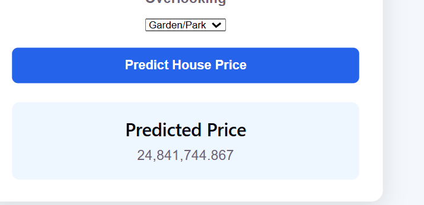
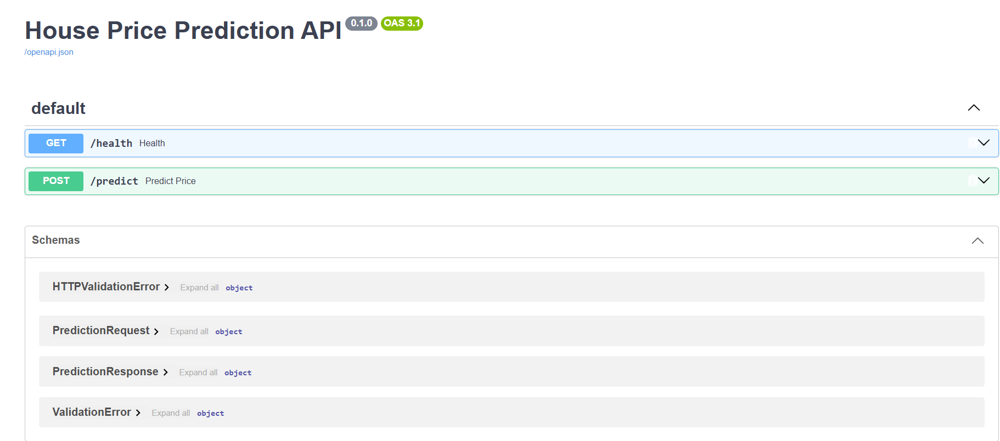

# 🏠 House Price Prediction

A full-stack Machine Learning application that predicts house prices based on property characteristics.

The project consists of:

* A Machine Learning model for house price prediction.
* A FastAPI backend that exposes the trained model through REST APIs.
* A React + Vite frontend that provides a user-friendly interface for entering property information and displaying the predicted price.

---

## 📌 Overview

The House Price Prediction project uses a trained Machine Learning model to estimate the price of a house based on several property features.

The user enters the property information through the React frontend. The frontend sends the data as a JSON request to the FastAPI backend.

The backend:

1. Validates the input using Pydantic.
2. Converts the request into the format expected by the trained model.
3. Loads the trained model during application startup.
4. Performs the prediction.
5. Returns the predicted house price as JSON.

### Application Flow

```text
User
  │
  ▼
React + Vite Frontend
  │
  │ POST /predict
  ▼
FastAPI Backend
  │
  ▼
Pydantic Validation
  │
  ▼
Preprocessing
  │
  ▼
Trained ML Model
  │
  ▼
Predicted House Price
  │
  ▼
React Frontend
```

---

## 🏗️ Architecture Diagram

```text
                    ┌─────────────────────┐
                    │        User         │
                    └──────────┬──────────┘
                               │
                               ▼
                    ┌─────────────────────┐
                    │   React + Vite      │
                    │      Frontend       │
                    │    localhost:5173   │
                    └──────────┬──────────┘
                               │
                         POST /predict
                               │
                               ▼
                    ┌─────────────────────┐
                    │   FastAPI Backend   │
                    │    localhost:8000   │
                    └──────────┬──────────┘
                               │
                               ▼
                    ┌─────────────────────┐
                    │ Pydantic Validation │
                    └──────────┬──────────┘
                               │
                               ▼
                    ┌─────────────────────┐
                    │    Preprocessing    │
                    └──────────┬──────────┘
                               │
                               ▼
                    ┌─────────────────────┐
                    │   Trained ML Model  │
                    │   house_price.pkl   │
                    └──────────┬──────────┘
                               │
                               ▼
                    ┌─────────────────────┐
                    │  Predicted Price    │
                    └─────────────────────┘
```

---

## 🛠️ Tech Stack

### Machine Learning

* Python
* Pandas
* NumPy
* Scikit-learn
* XGBoost
* Joblib

### Backend

* FastAPI
* Uvicorn
* Pydantic
* Pydantic Settings
* Pandas
* Scikit-learn
* XGBoost
* Joblib

### Frontend

* React
* Vite
* JavaScript
* CSS

### Testing

* Pytest
* FastAPI TestClient
* HTTPX

---

## 📂 Project Structure

```text
house-price-apps/
│
├── backend/
│   │
│   ├── app/
│   │   ├── api/
│   │   │   └── routes/
│   │   │       └── prediction.py
│   │   │
│   │   ├── core/
│   │   │   └── config.py
│   │   │
│   │   ├── schemas/
│   │   │   └── prediction.py
│   │   │
│   │   ├── services/
│   │   │   ├── preprocessing.py
│   │   │   └── inference.py
│   │   │
│   │   ├── utils/
│   │   │   └── logging_config.py
│   │   │
│   │   └── main.py
│   │
│   ├── models/
│   │   └── house_price.pkl
│   │
│   ├── tests/
│   │   └── test_prediction.py
│   │
│   ├── requirements.txt
│   ├── .env.example
│   └── Dockerfile
│
├── frontend/
│   ├── src/
│   │   ├── App.jsx
│   │   ├── App.css
│   │   └── ...
│   │
│   ├── package.json
│   ├── package-lock.json
│   └── ...
│
├── notebooks/
│   └── ...
│
├── screenshots/
│   ├── frontend.png
│   ├── prediction.png
│   └── swagger.png
│
├── .gitignore
├── .gitattributes
└── README.md
```

---

# 📊 Dataset

The project uses a house-price dataset containing property information such as:

* Carpet Area
* Bathroom
* Balcony
* Car Parking
* Floor
* Location
* Furnishing
* Ownership
* Facing
* Overlooking

## Dataset Source

The dataset is available on Kaggle:

**Kaggle Dataset:**
`PASTE YOUR FULL KAGGLE DATASET LINK HERE`

> Replace the line above with the complete Kaggle URL from the dataset page.

### Download Instructions

1. Open the Kaggle dataset link.
2. Download the dataset files.
3. Extract the files if the dataset is compressed.
4. Place the dataset in the appropriate project/data directory if required.
5. Use the notebook in the `notebooks/` directory to reproduce the preprocessing and model training process.

---

# 🤖 Machine Learning Model

The trained model is serialized using `joblib` and loaded by the FastAPI backend.

The backend loads the model once during application startup rather than loading it for every prediction request.

### Model File

```text
backend/models/house_price.pkl
```

The model receives the property features and returns a predicted house price.

The trained model depends on the required Python ML libraries, including XGBoost.

---

# 📈 Model Metrics

The final model was evaluated using the following metrics:

| Metric |        Value |
| ------ | -----------: |
| MAE    | 1,082,523.04 |
| RMSE   | 3,188,486.44 |
| R²     |       0.9436 |

### MAE — Mean Absolute Error

Measures the average absolute difference between the actual and predicted prices.

```text
MAE = average(|actual - predicted|)
```

### RMSE — Root Mean Squared Error

Measures prediction error while giving larger errors more weight.

```text
RMSE = sqrt(mean((actual - predicted)²))
```

### R² — R-Squared

Measures how much of the variation in house prices is explained by the model.

```text
R² = 1 - SSres / SStot
```

---

# ⚙️ Backend Setup

## 1. Open the backend directory

From the project root:

```powershell
cd backend
```

## 2. Create a virtual environment

If the virtual environment does not already exist:

```powershell
python -m venv .venv
```

## 3. Activate the virtual environment

On Windows PowerShell:

```powershell
.\.venv\Scripts\Activate.ps1
```

You should see:

```text
(.venv)
```

at the beginning of the terminal.

## 4. Install dependencies

```powershell
pip install -r requirements.txt
```

The requirements file includes the libraries needed to run the API and load the trained model, including:

* FastAPI
* Uvicorn
* Pydantic
* Pydantic Settings
* Pandas
* NumPy
* Scikit-learn
* XGBoost
* Joblib
* Pytest
* HTTPX

---

# ▶️ Run the Backend

From the `backend` directory with the virtual environment activated:

```powershell
python -m uvicorn app.main:app --reload
```

The API will run on:

```text
http://127.0.0.1:8000
```

FastAPI Swagger documentation:

```text
http://127.0.0.1:8000/docs
```

---

# 🔌 API Reference

## Health Check

### GET `/health`

Checks whether the API is running.

### Example

```text
GET http://127.0.0.1:8000/health
```

### Expected Response

```json
{
  "status": "ok"
}
```

---

## 🔮 House Price Prediction

### POST `/predict`

Predicts the price of a house based on its characteristics.

### Endpoint

```text
POST http://127.0.0.1:8000/predict
```

### Request Body

```json
{
  "carpet_area": 1200,
  "bathroom": 2,
  "balcony": 2,
  "car_parking": 1,
  "floor": 3,
  "location": "Thane",
  "furnishing": "Semi-Furnished",
  "ownership": "Freehold",
  "facing": "East",
  "overlooking": "Garden/Park"
}
```

### Input Features

| Feature       | Type   | Example        |
| ------------- | ------ | -------------- |
| `carpet_area` | float  | 1200           |
| `bathroom`    | float  | 2              |
| `balcony`     | float  | 2              |
| `car_parking` | float  | 1              |
| `floor`       | float  | 3              |
| `location`    | string | Thane          |
| `furnishing`  | string | Semi-Furnished |
| `ownership`   | string | Freehold       |
| `facing`      | string | East           |
| `overlooking` | string | Garden/Park    |

### Response

```json
{
  "predicted_price": 123456.78
}
```

The actual prediction value depends on the trained model and input features.

---

# 💻 cURL Example

The API can also be tested using cURL:

```bash
curl -X POST "http://127.0.0.1:8000/predict" ^
  -H "Content-Type: application/json" ^
  -H "Accept: application/json" ^
  -d "{\"carpet_area\":1200,\"bathroom\":2,\"balcony\":2,\"car_parking\":1,\"floor\":3,\"location\":\"Thane\",\"furnishing\":\"Semi-Furnished\",\"ownership\":\"Freehold\",\"facing\":\"East\",\"overlooking\":\"Garden/Park\"}"
```

> The example above uses Windows Command Prompt syntax. For PowerShell, Swagger `/docs` can be used to test the endpoint easily.

---

# 🌐 Frontend Setup

The frontend is built using React and Vite.

## 1. Open the frontend directory

From the project root:

```powershell
cd frontend
```

## 2. Install dependencies

```powershell
npm install
```

## 3. Start the development server

```powershell
npm run dev
```

The frontend will normally be available at:

```text
http://localhost:5173/
```

---

# 🔗 Frontend → Backend Communication

The React frontend sends prediction requests to:

```text
http://127.0.0.1:8000/predict
```

The request is sent using:

```javascript
fetch("http://127.0.0.1:8000/predict", {
  method: "POST",
  headers: {
    "Content-Type": "application/json",
    "Accept": "application/json"
  },
  body: JSON.stringify(requestData)
});
```

The frontend receives:

```json
{
  "predicted_price": 123456.78
}
```

and displays the predicted price to the user.

---

# 🔐 Environment Variables

The backend uses environment variables for application configuration.

Create a `.env` file inside the `backend` directory:

```env
APP_NAME=House Price Prediction API
MODEL_PATH=models/house_price.pkl
```

The example configuration is also provided in:

```text
backend/.env.example
```

Do not commit sensitive values such as passwords, API keys, or private credentials to GitHub.

---

# 🧪 Testing

The backend includes automated tests using Pytest and FastAPI's `TestClient`.

Run:

```powershell
python -m pytest tests/test_prediction.py -vv
```

The test suite includes:

### Test 1 — Health Check

Verifies that the health endpoint works correctly.

### Test 2 — Invalid Prediction Input

Verifies that invalid input is rejected with HTTP `422`.

Expected result:

```text
2 passed
```

Example:

```text
tests/test_prediction.py::test_health PASSED
tests/test_prediction.py::test_invalid_prediction PASSED

2 passed
```

---

# 🩺 API Validation

FastAPI automatically validates incoming requests using Pydantic.

For invalid request data, the API returns:

```text
422 Unprocessable Entity
```

Example:

```json
{
  "detail": [
    {
      "type": "missing",
      "loc": [
        "body",
        "carpet_area"
      ]
    }
  ]
}
```

---

# 🌍 CORS

The backend allows requests from the local Vite frontend:

```text
http://localhost:5173
```

and:

```text
http://127.0.0.1:5173
```

This allows the React application to communicate with the FastAPI API during local development.

---

# 🖼️ Screenshots

## Frontend


## Prediction Result



## FastAPI Swagger Documentation



---

# 🚀 Running the Complete Application

To run the complete project, open two terminals.

## Terminal 1 — Backend

```powershell
cd house-price-apps\backend
```

Activate the virtual environment:

```powershell
.\.venv\Scripts\Activate.ps1
```

Run FastAPI:

```powershell
python -m uvicorn app.main:app --reload
```

Backend:

```text
http://127.0.0.1:8000
```

Swagger:

```text
http://127.0.0.1:8000/docs
```

---

## Terminal 2 — Frontend

```powershell
cd house-price-apps\frontend
```

Install dependencies if needed:

```powershell
npm install
```

Run the frontend:

```powershell
npm run dev
```

Frontend:

```text
http://localhost:5173/
```

---

# 🔄 Complete Prediction Workflow

```text
1. User opens the React application
        ↓
2. User enters house information
        ↓
3. React collects and validates the form data
        ↓
4. React sends POST /predict
        ↓
5. FastAPI receives the JSON request
        ↓
6. Pydantic validates the request
        ↓
7. Backend preprocesses the input
        ↓
8. Trained ML model predicts the price
        ↓
9. FastAPI returns predicted_price
        ↓
10. React displays the predicted price
```

---

# 🛡️ Error Handling

The application handles common errors such as:

* Invalid request data
* Missing required fields
* Invalid numeric values
* Backend connection failures
* Invalid prediction responses

FastAPI returns HTTP `422` for validation errors.

The frontend displays an error message when the prediction request fails.

---

# 📦 Model Loading

The trained model is loaded once during FastAPI application startup using the application's lifespan.

This avoids loading the model file for every prediction request.

The startup process is approximately:

```text
FastAPI starts
      ↓
Load trained model
      ↓
Store model in application state
      ↓
API becomes available
```

---

# 📜 License

This project was developed as a student Machine Learning / Full-Stack project.

Add the appropriate license if a specific license is required.

---

# 👩‍💻 Project Status

### Completed

* Machine Learning model
* Model serialization
* FastAPI backend
* Prediction endpoint
* Health endpoint
* Pydantic validation
* CORS configuration
* React frontend
* Frontend/backend integration
* Backend tests
* API documentation through Swagger
* GitHub repository
* Git LFS for the large trained model
* Project README
* Application screenshots

### Final Verification

The project should be verified by cloning the GitHub repository into a fresh directory and following the setup instructions in this README.

---
